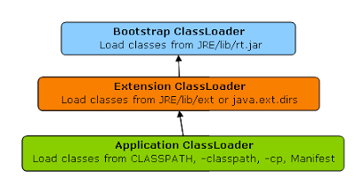
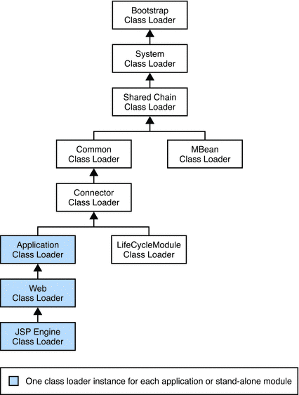

Java ClassLoader Demo
=====================

Class loaders are responsible for loading Java classes dynamically to the JVM (Java Virtual Machine) during runtime. They're also part of the JRE (Java Runtime Environment).
Therefore, the JVM doesn't need to know about the underlying files or file systems in order to run Java programs thanks to class loaders.

Furthermore, these Java classes aren't loaded into memory all at once, but rather when they're required by an application. This is where class loaders come into the picture.
They're responsible for loading classes into memory.

# Classloaders

* Bootstrap ClassLoader: Loads the core JDK runtime classes
* Extension ClassLoader: Loads Java Virtual Machine extensions. The classes loaded are defined by the value of the java.ext.dirs Java system property.
* Application ClassLoader: Loads application classes. The classes loaded are defined by the value of the CLASSPATH environment variable or the -classpath Java option
* User Defined ClassLoader: Loads classes from a custom source

# ClassLoader Hierarchy

# References

* Java ClassLoader: https://www.digitalocean.com/community/tutorials/java-classloader
* Class Loaders in Java: https://www.baeldung.com/java-classloaders